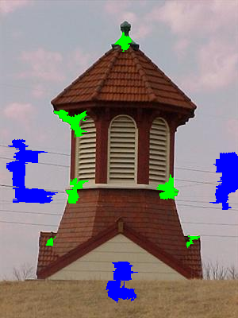

This project is an example of improved graph-based interactive image segmentation technique using an efficient pixel segment similarity measure for edge-weight assignment that takes both intensity and smoothness features into account. This was done by Mr. Kaustubh S. Shejole under the guidance of Prof. Gaurav Mishra at VNIT, Nagpur. The work is under review with IEEE Transactions on Image Processing.

# Title: PSSI-MaxST: An Efficient Pixel-Segment Similarity Index Using Intensity and Smoothness Features for Maximum Spanning Tree Based Segmentation

Interactive graph-based segmentation methods partition an image into foreground and background regions with the aid of user inputs. However, existing approaches often suffer from high computational costs, sensitivity to user interactions, and degraded performance when the foreground and background share similar color distributions. A key factor influencing segmentation performance is the similarity measure used for assigning edge weights in the graph.
To address these challenges, we propose a novel Pixel Segment Similarity Index (PSSI), which leverages the harmonic mean of inter-channel similarities by incorporating both pixel intensity and spatial smoothness features. The harmonic mean effectively penalizes dissimilarities in any individual channel, enhancing robustness. The computational complexity of PSSI is $\mathcal{O}(B)$, where $B$ denotes the number of histogram bins.
Our segmentation framework begins with low-level segmentation using MeanShift, which effectively captures color, texture, and segment shape. Based on the resulting pixel segments, we construct a pixel-segment graph with edge weights determined by PSSI. For partitioning, we employ the Maximum Spanning Tree (MaxST), which captures strongly connected local neighborhoods beneficial for precise segmentation.
The integration of the proposed PSSI, MeanShift, and MaxST allows our method to jointly capture color similarity, smoothness, texture, shape, and strong local connectivity. Experimental evaluations on the GrabCut and Images250 datasets demonstrate that our method consistently outperforms current graph-based interactive segmentation methods such as AMOE, OneCut, and SSNCut in terms of segmentation quality, as measured by Jaccard Index (IoU), $F_1$ score, execution time and Mean Error (ME).

We used two datasets:
1. GrabCut: https://github.com/powerhope/AMOE/tree/master/AMOE/imagesgrabcut
2. Images250: https://github.com/powerhope/AMOE/tree/master/AMOE/images250


For evaluation the scribbles used can be found at: https://github.com/powerhope/AMOE/Our markers i.e., optimal markers for our method can are present in our_markers_images250.zip

---

## **Setup the project**
## **Setup Instructions**

### Step 1: Clone the Repository
```bash
git clone https://github.com/KaustubhShejole/PSSI-MaxST/
```
```bash
cd ImageSegmentationUsingGraphTheory/Code_using_MeanShift
```

### Step 2: Install Requirements
Install the required Python packages listed in `requirements.txt`:

```bash
pip install -r requirements.txt
```

### Step 3: Verify Dependencies
Ensure you have the following installed:
- Python 3.6 or higher
- OpenCV
- NumPy
- Matplotlib
- Scikit-Image

You can verify installation with:
```bash
python -c "import cv2, numpy, matplotlib, skimage"
```


## 🔬 Demo: PSSI-MaxST Segmentation

We provide a demo pipeline to show how **PSSI-MaxST** operates on sample images.  
The demo includes input images, ground truth (GT), scribbles, intermediate results, and final segmentation metrics.


To run the demo on an image:

```bash
cd demo_pssi_maxst
python main.py images/0_0_547.jpg
```

---

| Input Image | Ground Truth (GT) |
|-------------|-------------------|
|  |  |

| Scribbles (green: foreground, blue: background) | Superpixel Visualisation |
|-------------------------------------------------|--------------------------|
|  |  |

### Segmentation Result
The final segmentation obtained using PSSI-MaxST.  

| Predicted Mask | Segmented Output |
|----------------|------------------|
|  |  |

---

### Quantitative Results
The text file below reports IoU, Recall, Precision, F1-Score, Accuracy, and execution time.  

Full text file: [Metrics](demo_pssi_maxst/text_results/0_0_547_1_1.txt)

This demo demonstrates how **PSSI-MaxST** works end-to-end, from input to evaluation, with both qualitative and quantitative validation.


## **Troubleshooting**

- Check directory paths in `parameters_and_data.py`.
- Install any missing Python packages as prompted.

---

## **License**
This project is licensed under the MIT License.

---

## **Contact**
For questions or issues, please contact [kaustubhshejole@cse.iitb.ac.in].
